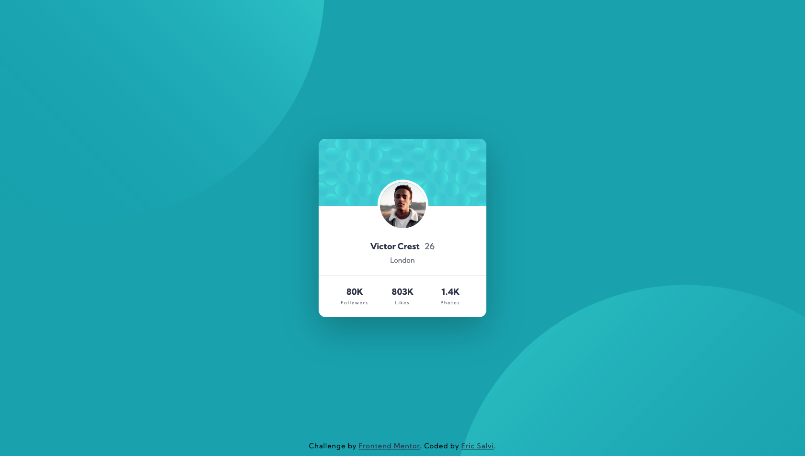

# Frontend Mentor - Profile card component solution

This is a solution to the [Profile card component challenge on Frontend Mentor](https://www.frontendmentor.io/challenges/profile-card-component-cfArpWshJ). Frontend Mentor challenges help you improve your coding skills by building realistic projects. 

## Table of contents

- [Overview](#overview)
  - [The challenge](#the-challenge)
  - [Screenshot](#screenshot)
  - [Links](#links)
- [My process](#my-process)
  - [Built with](#built-with)
  - [Useful resources](#useful-resources)
- [Author](#author)

## Overview

### The challenge

- Build out the project to the designs provided

### Screenshot

### Links

- Solution URL: [https://github.com/ericsalvi/profile-card-component](https://github.com/ericsalvi/profile-card-component)
- Live Site URL: [https://ericsalvi.github.io/profile-card-component/](https://ericsalvi.github.io/profile-card-component/)

## My process

### Built with

- Semantic HTML5 markup
- CSS custom properties
- CSS variables for color
- Flexbox
- Mobile-first workflow
- Visual Studio Code
- https://autoprefixer.github.io/
- axe DevTools for accessibility

### Useful resources

- [Box Shadow Generator](https://html-css-js.com/css/generator/box-shadow/) - This helped me to build out my box-shadow for the card item. It is sometimes much easier to use onscreen controls to visualize instead of guessing at the size and spread.

## Author

- Website - [Eric Salvi](https://github.com/ericsalvi)
- Frontend Mentor - [@ericsalvi](https://www.frontendmentor.io/profile/ericsalvi)